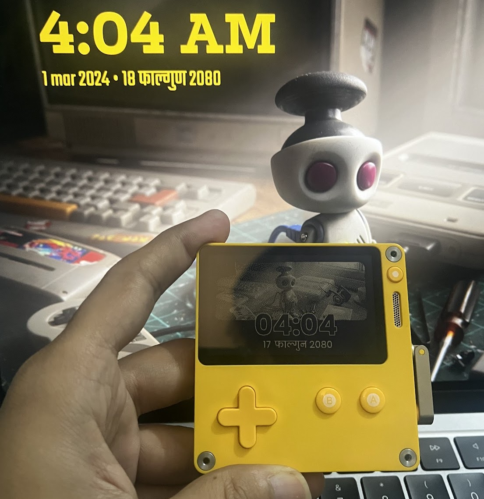

# miti.today for playdate

A Playdate application that displays Nepali date and time in ([Bikram Sambat](https://en.wikipedia.org/wiki/Vikram_Samvat)).

Written in Lua.

[Related Blog](https://niravko.com/blog/nepali-date-on-play-date)

Data adopted from [sharingapples/nepali-date](https://github.com/sharingapples/nepali-date/blob/master/src/config.js)
